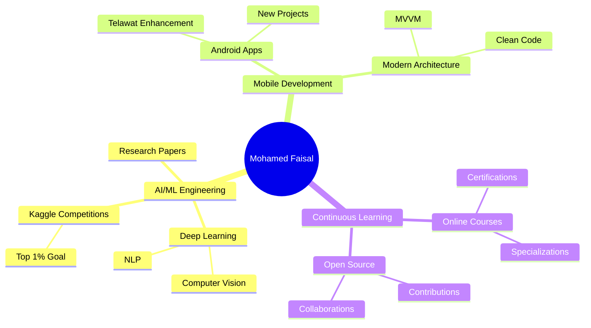

<div align="center">

<!-- Animated Header Banner -->


<!-- Typing Animation with Updated Text -->
<a href="https://git.io/typing-svg">
  
</a>

<br/>

<!-- Animated GIF -->


<br/><br/>

<!-- Social Media Badges with Gradient Colors -->
<p align="center">
  <a href="https://linkedin.com/in/mohamed-faisal-748051360">
    
  </a>
  <a href="https://github.com/mohamed-faisal-salem">
    
  </a>
  <a href="mailto:engmohamedfaisal06@gmail.com">
    
  </a>
  <a href="https://instagram.com/mohamed_faisal.06">
    
  </a>
  <a href="https://kaggle.com/mohamedfaisalsalem">
    
  </a>
</p>

<!-- Profile Views Counter -->
<p align="center">
  
</p>

</div>

---

## 🧑‍💻 About Me

```python
class MohamedFaisal:
    def __init__(self):
        self.name = "Mohamed Faisal Salem"
        self.role = "AI/ML Engineer | Android Developer"
        self.education = {
            "university": "Cairo University",
            "faculty": "Faculty of Computers and Artificial Intelligence (FCAI)",
            "year": "Second Year",
            "focus": ["Machine Learning", "Deep Learning", "NLP"]
        }
        self.location = "Cairo, Egypt 🇪🇬"
        self.languages = ["Arabic (Native)", "English (Fluent)"]
        
    def current_focus(self):
        return [
            "🤖 Building intelligent AI systems",
            "📊 Competing in Kaggle challenges",
            "📱 Developing impactful mobile applications",
            "📚 Deepening knowledge in Deep Learning & NLP",
            "🔬 Exploring cutting-edge ML research"
        ]
    
    def achievements(self):
        return {
            "kaggle": {
                "house_prices": "Top 4% 🏆",
                "titanic": "Top 26% 🚢"
            },
            "projects": {
                "telawat_app": "230+ Reciters | 1000+ Downloads 📱",
                "ai_models": "Multiple ML/DL implementations 🧠"
            }
        }
    
    def say_hi(self):
        print("Thanks for visiting! Let's connect and build something amazing together! 🚀")

me = MohamedFaisal()
me.say_hi()
```

<div align="center">

### 💡 *"Passionate about transforming theoretical AI concepts into practical, real-world solutions"*

</div>

---

## 🛠️ Technical Arsenal

<div align="center">

### **Languages & Frameworks**

<p>
  
</p>

### **AI/ML & Data Science**

<p>
  
  
  
  
  
  
</p>

### **Mobile Development**

<p>
  
  
  
</p>

### **Tools & Technologies**

<p>
  
  
  
</p>

</div>

---
## 📊 My GitHub Journey


---

---

## 📊 GitHub Statistics

<div align="center">
  
  <!-- GitHub Stats Card -->
  
  
  <!-- GitHub Streak Stats -->
  

</div>

<div align="center">
  
  <!-- Most Used Languages -->
  
  
  <!-- Activity Graph -->
  

</div>

---

## 🏆 Achievements & Milestones

<div align="center">

### **Kaggle Competitions**

<table>
  <tr>
    <td align="center" width="50%">
      
      <br/>
      <sub>Advanced Regression Techniques</sub>
    </td>
    <td align="center" width="50%">
      
      <br/>
      <sub>Survival Prediction Challenge</sub>
    </td>
  </tr>
</table>

### **Certifications**

<p>
  
  
  
</p>

### **GitHub Trophies**


</div>

---

## 🚀 Featured Projects

<div align="center">

<!-- Project 1: Telawat App -->
<table>
  <tr>
    <td width="50%" align="center">
      
    </td>
    <td width="50%">
      <h3>📱 Telawat - Quran Recitation App</h3>
      <p><strong>A comprehensive Android application featuring 230+ reciters</strong></p>
      <p>
        <code>Java</code>
        <code>XML</code>
        <code>Firebase</code>
        <code>ExoPlayer</code>
        <code>Material Design</code>
      </p>
      <ul align="left">
        <li>✅ 230+ Reciters with multiple recitation styles</li>
        <li>✅ Offline download & background playback</li>
        <li>✅ Smart search & favorites system</li>
        <li>✅ Light/Dark mode support</li>
        <li>✅ Material Design 3 UI/UX</li>
      </ul>
      <a href="https://github.com/mohamed-faisal-salem/Telawat">
        
      </a>
    </td>
  </tr>
</table>

<br/>

<!-- Add more projects here with similar structure -->
<details>
<summary><b>🔍 View More Projects</b></summary>
<br/>

<table>
  <tr>
    <td width="50%" align="center">
      <h3>🤖 Machine Learning Projects</h3>
      <p>Collection of ML implementations and experiments</p>
      <p>
        <code>Python</code>
        <code>Scikit-learn</code>
        <code>Pandas</code>
      </p>
    </td>
    <td width="50%" align="center">
      <h3>🧠 Deep Learning Models</h3>
      <p>Neural network architectures and experiments</p>
      <p>
        <code>TensorFlow</code>
        <code>PyTorch</code>
        <code>Keras</code>
      </p>
    </td>
  </tr>
  <tr>
    <td width="50%" align="center">
      <h3>📊 Data Analysis Projects</h3>
      <p>Exploratory data analysis and visualization</p>
      <p>
        <code>Pandas</code>
        <code>Matplotlib</code>
        <code>Seaborn</code>
      </p>
    </td>
    <td width="50%" align="center">
      <h3>💻 Competitive Programming</h3>
      <p>Problem-solving and algorithm implementations</p>
      <p>
        <code>C++</code>
        <code>Python</code>
        <code>Algorithms</code>
      </p>
    </td>
  </tr>
</table>

</details>

</div>

---

## 📈 Contribution Activity

<div align="center">

<!-- 3D Contribution Graph -->


<!-- Contribution Snake Animation -->
<picture>
  <source media="(prefers-color-scheme: dark)" srcset="https://raw.githubusercontent.com/mohamed-faisal-salem/mohamed-faisal-salem/output/github-contribution-grid-snake-dark.svg">
  <source media="(prefers-color-scheme: light)" srcset="https://raw.githubusercontent.com/mohamed-faisal-salem/mohamed-faisal-salem/output/github-contribution-grid-snake.svg">
  
</picture>

</div>

---

## 🎯 Current Goals & Focus Areas

<div align="center">



</div>

### **🎓 Learning Roadmap**

- 🔹 Advanced Deep Learning Architectures (Transformers, GANs)
- 🔹 Natural Language Processing with Transformers
- 🔹 Computer Vision & Object Detection
- 🔹 MLOps & Model Deployment
- 🔹 Advanced Android Development (Jetpack Compose)
- 🔹 Cloud Computing & Distributed Systems

### **💼 Professional Goals**

- 🎯 Achieve Top 1% in Kaggle Competitions
- 🎯 Contribute to Open Source AI/ML Projects
- 🎯 Publish Research Papers in AI/ML
- 🎯 Build Production-Ready AI Applications
- 🎯 Secure AI/ML Engineering Internship
- 🎯 Expand Mobile Development Portfolio

---

## 💬 Let's Connect!

<div align="center">

### **I'm always open to:**

💡 Collaborating on AI/ML projects  
🤝 Contributing to open-source initiatives  
📚 Discussing latest trends in Deep Learning  
🚀 Building innovative mobile applications  
☕ Chatting about technology and innovation  

<br/>

### **📫 Reach Out To Me:**

<p>
  <a href="mailto:engmohamedfaisal06@gmail.com">
    
  </a>
</p>

<p>
  <a href="https://linkedin.com/in/mohamed-faisal-748051360">
    
  </a>
</p>

<br/>

### **💭 Quote of the Day**


</div>

---

<div align="center">

### **⭐ If you find my work interesting, consider starring my repositories!**


<sub>Made with ❤️ and lots of ☕</sub>

</div>
